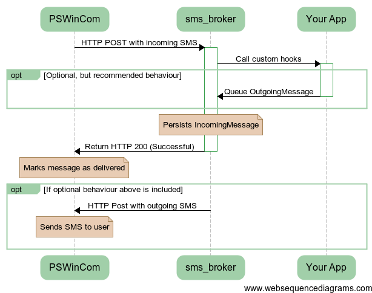

sms_broker
==========

This gem handles communication with an SMS Gateway and storage of incoming and outgoing SMSes.

The gem is currently designed to work with PSWinCom's SMS gateway, but with a little bit of work it should be no problem making it more generic. I simply have not taken the time to do so. Any pull requests are welcome. :-)

How it works
------------

The gem is roughly comprised of the following:

  * An endpoint for receiving SMSes.
  * Logic to allow custom code to executed when an SMS is received.
  * Two database tables for persisting incoming and outgoing SMSes.
  * A queuing mechanism for sending SMSes (using the delayed_job gem). For sending SMS to the gateway, you only need to add data to the database table for outgoing messages and the rest is taken care of.

An illustration of the sequence of events when an SMS is received:

<!-- Code for generating diagram at www.websequencediagrams.com

PSWinCom->sms_broker: HTTP POST with incoming SMS
activate sms_broker

"sms_broker"->Your App: Call custom hooks
activate Your App

opt Optional, but recommended behaviour
    Your App -> sms_broker: Queue OutgoingMessage
deactivate Your App
    note over sms_broker: Persist OutgoingMessage
end

note over sms_broker: Persists IncomingMessage

sms_broker->PSWinCom: Return HTTP 200 (Successful)
deactivate sms_broker

note over PSWinCom: Marks message as delivered

opt If optional behaviour above is included
    sms_broker->PSWinCom: HTTP Post with outgoing SMS
    note over PSWinCom: Sends SMS to user
end

-->

Installation
============

### Add gem

Add sms_broker to the applications `Gemfile`:

    gem 'sms_broker', :git => 'git://github.com/legelisten/sms_broker.git'

### Set up routes

Enable reception of SMSes by setting up sms_broker's routes. In your app, add the following to `config/routes.rb`:

    mount SmsBroker::Engine, at: "/sms_broker"

This will create your endpoint at `http://<your-app>/sms_broker/receive`. You will need to configure the PSWinCom gateway to use use HTTP to post incoming messages to this URL.

### Database setup

The gem also supplies a few necessary database tables. To install and run the migrations, issue the following commands from within your app:

    rake sms_broker:install:migrations
    rake db:migrate

All table names will be prefixed with "sms_broker_"

### Environment variables

To avoid committing sensitive information to your version control system, as well as enable quick and simple reconfiguration, the gem expects the following environment variables to be set:

<table border="1">
  <thead>
    <tr>
      <th width="200">Environment variable</th><th>Description</th>
    </tr>
  <thead>
  <tr>
    <td>SMS_SEND_USER</td><td>SMS gateway username for sending SMS</td>
  </tr>
  <tr>
    <td>SMS_SEND_PASSWORD</td><td>SMS gateway password for sending SMS</td>
  </tr>
  <tr>
    <td>SMS_SEND_URL</td><td>The complete URL to which sms_broker should post SMSes. For example: http://sms3.pswin.com:80/sms</td>
  </tr>
  <tr>
    <td>SMS_IP_WHITELIST</td><td>Comma separated list of IP addresses from which to accept incoming SMSes. For example: "217.149.126.54,62.92.103.106,85.19.118.116" (These are the actual addresses PSWinCom use to deliver incoming SMS.</td>
  </tr>
</table>

Customizing
===========

Add an initializer to your app called `config/initializers/sms_broker.rb`, all the following customization should be added to this file.

### Change default sender

You can change the default sender name displayed to the receiver of your SMSes.

    module SmsBroker
        config.default_sender = "<YOUR SENDER NAME HERE>"
    end

Please note that PSWinCom limits the sender name to 11 characters. See their technical documentation for further details.

### Changing the program flow

This gem basically does two things. It 1) offers an endpoint to which PSWinCom's SMS gateway can post incoming messages, and 2) Handles the sending of outgoing messages to PSWinCom.

When running some kind of SMS service you probably want to perform some action based on incoming SMSes. For this purpose you can register hooks that are fired by `IncomingMessage`'s `after_create` callback.

    module SmsBroker

      class ServiceHook
        def self.execute(incoming_message)
          <YOUR SMS SERVICE CODE HERE>
        end
      end

      SmsBroker::IncomingMessage.register_after_create_hook(ServiceHook)

    end

At the least, you probably want your service code to check the format of the IncomingMessage's text attribute (`incoming_message.text`) and do the following:

* Create an OutgoingMessage addressed to the sender of the incoming message, containing the result of your service.
* Raise an exception if you are unable to handle the message. This will cause storage of the incoming message to be aborted, and an HTTP 400 (Bad Request) status to be returned to the PSWinCom gateway.

Final notes
===========

This gem is published in the hope that it might save someone else some time in setting up their SMS service. If you want to use this gem and are running in to problems, do not hesitate to get in touch (<roger@legelisten.no>).
